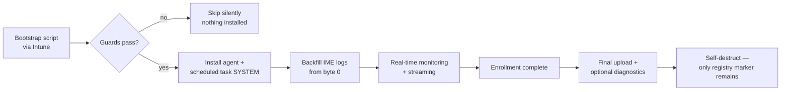

# Agent Lifecycle & Security

The Autopilot Monitor agent is a lightweight .NET application that exists on a device **only for the duration of the enrollment**. This page explains its lifecycle and the security measures built around it.

## Lifecycle

1. **Installation** — the [bootstrap script](../getting-started/deploy-the-agent.md) installs the agent and a scheduled task running as SYSTEM, but only on devices that pass all pre-requisite guards.
2. **Backfill — the full timeline from T=0** — the Intune Management Extension (IME) writes detailed logs from the first second of enrollment, long before the agent exists. On first launch the agent reads those logs **from byte position zero** — including archived (rotated) files, processed in chronological order. Every app state change, phase transition, and script execution that happened before the agent arrived is reconstructed, so the timeline has no blind spots.
3. **Real-time monitoring** — after the backfill, the agent switches to incremental polling: it tracks its byte position in each log file and reads only new data, streaming events to the backend as they happen, alongside its own collectors (device info, performance snapshots, security posture, Windows Hello and ESP signals).
4. **Completion** — when the enrollment completes (see [Sessions & Statuses](sessions-and-statuses.md#how-completion-is-detected)), the agent performs a final upload and, if configured, collects a diagnostics package. As a hard backstop the agent never runs longer than 6 hours.
5. **Self-destruct** — the agent removes its files and scheduled task. The only artifact left is the registry marker `HKLM:\SOFTWARE\AutopilotMonitor\Deployed`, which permanently prevents re-installation on that device. Self-destruct behavior is configurable per tenant (e.g. keep the log file, reboot on completion). On top of the normal lifecycle there is an unconditional **48-hour emergency brake**: 48 hours after installation the agent removes itself no matter what state it is in — no orphaned agent ever remains on a device.


**Per-enrollment by design.** The agent is not a permanent management footprint. If you re-enroll a device (after a reset the registry marker is gone too, since a reset wipes the disk), a fresh agent is installed for the new enrollment.


## Authentication

* The agent authenticates every backend call with the device's **MDM client certificate** — the certificate Intune issues to the device during enrollment (mutual TLS). Only genuinely Intune-enrolled devices can talk to the backend.
* On the backend side, **Autopilot Device Validation** additionally verifies the device is registered as an Autopilot device in *your* tenant before any session data is accepted.
* For the short window at the very start of OOBE where no MDM certificate exists yet, optional **Bootstrap Tokens** provide pre-MDM authentication (see [Bootstrap Script & Tokens](../reference/bootstrap-script-and-tokens.md)).
* All communication uses HTTPS with TLS 1.2+.

## Binary integrity

Agent binaries are protected by SHA-256 verification at multiple stages:

1. **Build-time hashes** — the CI/CD pipeline computes a hash for the agent package (published in `version.json`) and one for the executable (stored in the backend configuration).
2. **Download verification** — the bootstrapper and the agent's self-updater verify the package hash before installation; a mismatch aborts the install.
3. **Backend cross-check** — the expected hash is *also* delivered through the authenticated configuration endpoint, an independent second trust channel. Tampering would require compromising the download server and the backend API simultaneously.
4. **Runtime self-check** — the running agent hashes its own executable and compares it against the value from the backend; a mismatch raises an emergency alert.

## What data is collected

The agent collects **enrollment telemetry**, not user data:

* ESP phases and enrollment progress signals
* App installations (names, IDs, states, error codes) and script executions as reported by the IME
* Device information: hardware model, OS version/build, network configuration, security posture (e.g. Secure Boot status)
* Performance snapshots (CPU, memory, disk) during enrollment
* Optional, controlled by you: geo location (IP-based, for the Geographic Performance view), local admin account analysis, software inventory with vulnerability correlation, and a diagnostics package — uploaded to the built-in hosted storage or, if you prefer full control, to **your own Azure Blob Storage**

What the agent collects is itself configurable through Agent Settings, Collectors, Analyzers, and [Gather Rules](../rules/gather-rules.md) — with strict guardrails on what custom collection is allowed to touch.
