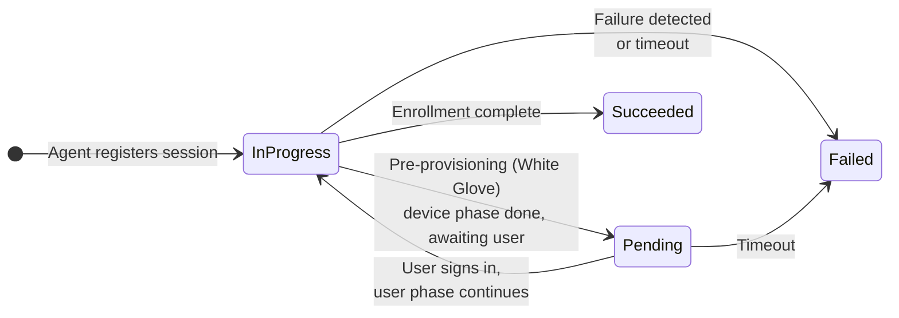

# Sessions & Statuses

## What is a session?

A **session** represents one Windows Autopilot enrollment attempt on one device. It starts when the agent registers with the backend during OOBE and collects everything that happens on the device until the enrollment finishes: ESP phase transitions, app installations, script executions, policies, performance snapshots, security posture, and any rule findings.

Each session is identified by the device (serial number, hardware info) and holds a chronological **timeline** of events. If the same device is reset and enrolled again later, that is a new session.

## Session statuses

| Status | Meaning |
| --- | --- |
| **In Progress** | Enrollment events are actively being received. The agent is monitoring the enrollment on the device. |
| **Pending** | The session is registered but waiting for the user enrollment phase. Typical after a **pre-provisioning (White Glove)** enrollment: the device phase is complete and the device waits for a user to sign in and continue. |
| **Succeeded** | The enrollment finished successfully — the device passed through all expected phases (or an admin manually marked it succeeded via Admin Mode). |
| **Failed** | The enrollment ended in failure — detected automatically by the agent/backend, marked failed by a firing analyze rule with "mark session as failed" enabled, or manually marked via Admin Mode. |

## How completion is detected

There is no single "enrollment done" signal in Windows, so the agent combines several independent evidence paths — for example the IME's own completion reporting, the ESP process exiting together with the Windows Hello enrollment prompt, and the user reaching the desktop. Whichever path completes first ends the session; this redundancy keeps completion detection reliable across user-driven, pre-provisioning, and kiosk/self-deploying scenarios.

## Timeouts — what happens to stuck sessions

Three separate mechanisms make sure a session never stays *In Progress* forever — and that no agent is ever left behind on a device:

* **Agent maximum lifetime (on the device):** the agent itself runs for at most **6 hours**. If enrollment hasn't completed by then, the agent performs a final upload and cleans itself up regardless.
* **Session timeout (in the backend):** sessions that stop receiving events are automatically marked **Failed — Timed Out** after the configured **Session Timeout** (default **5 hours**, configurable 1–12 hours under **Configuration → Maintenance → Data Management**). This catches devices that were powered off mid-enrollment or lost connectivity for good.
* **48-hour emergency brake (on the device):** independent of everything above, the agent unconditionally removes itself **48 hours after installation** — regardless of session status, connectivity, or whatever error state it might be in. Even in the worst failure scenario, no orphaned agent ever remains on a device.


A session marked *Failed — Timed Out* means the **evidence stopped**, not necessarily that the device is broken — a user may simply have shut the laptop mid-ESP. The session timeline still contains everything up to the last received event.


## Manual overrides (Admin Mode)

Admins can manually mark an *In Progress* or *Pending* session as **Succeeded** or **Failed** from the session detail page — useful when a session will clearly never complete on its own. Marking a session succeeded also signals the agent (if still running) to finish up and clean the device. These actions are gated behind the [Admin Mode](roles-and-permissions.md#admin-mode) safety toggle.
