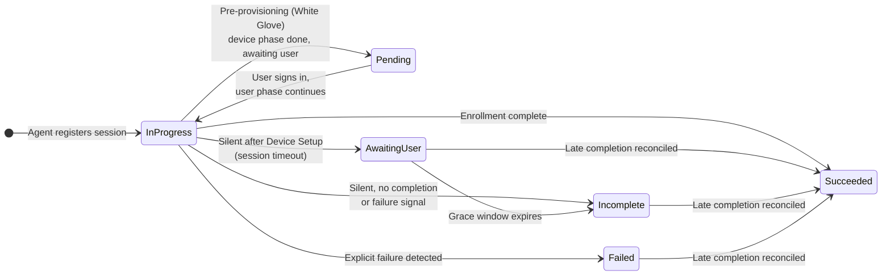

# Sessions & Statuses

## What is a session?

A **session** represents one Windows Autopilot enrollment attempt on one device. It starts when the agent registers with the backend during OOBE and collects everything that happens on the device until the enrollment finishes: ESP phase transitions, app installations, script executions, policies, performance snapshots, security posture, and any rule findings.

Each session is identified by the device (serial number, hardware info) and holds a chronological **timeline** of events. If the same device is reset and enrolled again later, that is a new session.

## Session statuses

| Status | Meaning |
| --- | --- |
| **In Progress** | Enrollment events are actively being received. The agent is monitoring the enrollment on the device. |
| **Pending** | The session is registered but waiting for the user enrollment phase. Typical after a **pre-provisioning (White Glove)** enrollment: the device phase is complete and the device waits for a user to sign in and continue. |
| **Awaiting User** | Non-terminal. Device Setup finished, but the user / Account Setup phase hasn't completed and the agent has gone silent — most often the user simply hasn't signed in yet (the device is provisioned and legitimately waiting at the login screen). The session parks here and **heals to _Succeeded_** if the enrollment completes later, or settles to _Incomplete_ once the grace window expires. |
| **Succeeded** | The enrollment finished successfully — the device passed through all expected phases (or an admin manually marked it succeeded via Admin Mode). A session that went silent and later produces a genuine completion signal is **reconciled** to Succeeded, even from Failed, Incomplete, or Awaiting User. |
| **Failed** | The enrollment ended in an **explicit** failure — a failure event from the agent/backend, a firing analyze rule with "mark session as failed" enabled, or a manual Admin Mode mark. A silent session that never sent a failure signal is **no longer** counted here (see [Timeouts](#timeouts-what-happens-to-stuck-sessions) below). |
| **Incomplete** | Terminal, but **not a failure**. The session went silent without ever producing either a completion or an explicit failure signal, and the grace window expired. It is excluded from the failure rate — it means "we lost the evidence trail", not "the enrollment broke". |

## How completion is detected

There is no single "enrollment done" signal in Windows, so the agent combines several independent evidence paths — for example the IME's own completion reporting, the ESP process exiting together with the Windows Hello enrollment prompt, and the user reaching the desktop. Whichever path completes first ends the session; this redundancy keeps completion detection reliable across user-driven, pre-provisioning, and kiosk/self-deploying scenarios.

## Timeouts: what happens to stuck sessions

Three separate mechanisms make sure a session never stays *In Progress* forever — and that no agent is ever left behind on a device:

* **Agent maximum lifetime (on the device):** the agent itself runs for at most **6 hours**. If enrollment hasn't completed by then, the agent emits an explicit failure event (which does mark the session *Failed*), performs a final upload, and cleans itself up.
* **Session timeout (in the backend):** sessions that stop receiving events are reclassified out of *In Progress* after the configured **Session Timeout** (default **5 hours**, configurable 1–12 hours under **Configuration → Maintenance → Data Management**). Crucially, a silent session is **no longer blanket-marked _Failed_** — the backend classifies it from the evidence it already has (see below).
* **48-hour emergency brake (on the device):** independent of everything above, the agent unconditionally removes itself **48 hours after installation** — regardless of session status, connectivity, or whatever error state it might be in. Even in the worst failure scenario, no orphaned agent ever remains on a device.

### Timeout ≠ failure

For a long time the 5-hour sweep marked *every* silent session **Failed**. That conflated "the agent stopped sending telemetry" with "the enrollment failed" and badly inflated failure rates — in practice the overwhelming majority of these "timeouts" were devices that had **finished Device Setup and were simply sitting at the login screen** waiting for a user, then completed the user phase hours (or a day) later.

The backend now decides the outcome from the last evidence in the timeline instead of hard-coding *Failed*:

| What the evidence shows | Result |
| --- | --- |
| An explicit failure event (`enrollment_failed`, ESP failure, agent max-lifetime) | **Failed** |
| Account Setup fully succeeded, or a completion signal arrived | **Succeeded** (reconciled) |
| Device Setup finished, user phase not yet done, still within the grace window | **Awaiting User** |
| Grace window expired with no completion and no failure | **Incomplete** |
| Silence before Device Setup even finished, with no failure event | **Incomplete** |

**The grace window** is anchored to the agent, not a magic number. Because the agent self-destructs at its 48-hour emergency brake and sends nothing afterwards, a completion can only ever arrive *before* that cap. The backend therefore waits out the cap plus a small buffer (~**51 hours** by default) before settling *Awaiting User* → *Incomplete* — long enough that a legitimately late user completion still lands and **reconciles to _Succeeded_**. This costs nothing on the device: a waiting session is just a table row compared against a timestamp — no process, no heartbeat, no extra agent load.


An **Incomplete** session means the **evidence stopped** without a verdict — a user may simply have shut the laptop mid-ESP, or the device went permanently offline. It is deliberately kept out of the failure rate. The session timeline still contains everything up to the last received event, and if a real completion or failure signal ever arrives, the status is corrected accordingly.


## Manual overrides (Admin Mode)

Admins can manually mark an *In Progress* or *Pending* session as **Succeeded** or **Failed** from the session detail page — useful when a session will clearly never complete on its own. Marking a session succeeded also signals the agent (if still running) to finish up and clean the device. These actions are gated behind the [Admin Mode](roles-and-permissions.md#admin-mode) safety toggle.
