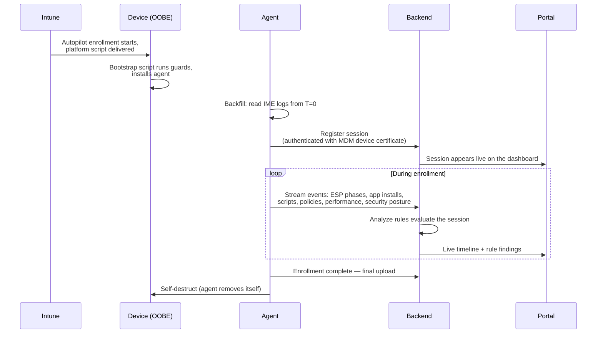

# How Autopilot Monitor Works

Autopilot Monitor consists of four components that work together to turn a Windows Autopilot enrollment from a black box into a live, analyzable timeline:

| Component | Where it runs | What it does |
| --- | --- | --- |
| **Bootstrap script** | On the device, via Intune | A PowerShell platform script that safely installs the agent — only on devices that are actually enrolling right now |
| **Monitoring agent** | On the device, during enrollment | A lightweight .NET application that collects enrollment telemetry in real time and removes itself when enrollment completes |
| **Backend** | Cloud (Azure) | Receives, validates, and stores telemetry; runs the analyze-rule engine against every session |
| **Web portal** | Browser | Live dashboard, session timelines, rule findings, fleet analytics, and all configuration |

## The flow of an enrollment

1. **Intune delivers the bootstrap script** as a platform script early in the enrollment. The script runs a series of safety guards and only installs the agent on a device that is genuinely mid-enrollment — already-provisioned devices are skipped silently, so the script is safe to assign broadly. See [Deploy the Agent](deploy-the-agent.md).
2. **The agent starts and backfills the timeline.** The Intune Management Extension (IME) has been logging since the first second of enrollment — before the agent existed on the device. The agent reads those logs from byte zero, so nothing that happened before its installation is lost. From then on it streams new activity in real time. See [Agent Lifecycle & Security](../concepts/agent-lifecycle-and-security.md).
3. **The backend validates and analyzes.** Every upload is authenticated with the device's MDM client certificate, and data is only accepted for devices registered in your Autopilot tenant (the consent gate you enable during [Portal Setup](portal-setup.md)). Analyze rules evaluate each session automatically and produce findings with explanations and remediation steps.
4. **You watch it live in the portal.** The session appears on the dashboard seconds after the agent starts. The timeline shows ESP phases, every app install with its outcome, scripts, policies, and any rule findings — while the device is still sitting at the Enrollment Status Page.
5. **The agent removes itself.** Once enrollment completes, the agent performs a final upload, optionally collects a diagnostics package, and self-destructs. Only a small registry marker remains, which prevents the agent from ever being installed on that device again.

## Design principles

* **Temporary by design.** The agent exists only for the duration of the enrollment. It is not a permanent management agent, does not persist across the device's life, and leaves the device the way Autopilot intended it.
* **Consent-gated.** No data is accepted by the backend until a Tenant Admin explicitly enables Autopilot Device Validation — and even then, only for devices registered in your own Intune tenant.
* **Authenticated end to end.** The agent authenticates with the device's MDM client certificate over TLS; agent binaries are SHA-256-verified at download and at runtime.
* **Analysis built in.** You don't just get raw logs — every session is evaluated by [analyze rules](../rules/overview.md) that turn signals into findings with concrete remediation guidance.

## Where to go next

Continue with [Requirements & Access](requirements-and-access.md) to get your tenant set up.
