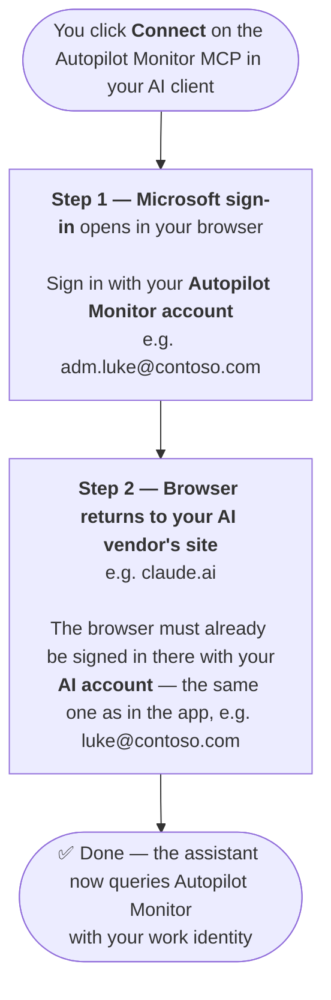

# AI Integration (MCP)

Autopilot Monitor exposes a **Model Context Protocol (MCP)** server that lets AI assistants query enrollment data conversationally: *"show me all failed enrollments from the last 24 hours"*, *"why did session X fail?"*, *"which devices are affected by CVE-2024-30078?"*. Connect Claude Desktop, VS Code with Claude, or any MCP client supporting Streamable HTTP.

## How it works

```
AI client  →  MCP server  →  Backend API  →  Your data
```

Your existing sign-in token is forwarded with every request — the MCP server stores no credentials, and all data access is scoped to your tenant exactly like in the portal.

## Prerequisites

1. **MCP access for your account** — enabled by an administrator (access is managed per user). Tenant admins can see usage under **Configuration → Reporting → MCP Usage**.
2. **An MCP-compatible client** — Claude Desktop, VS Code with the Claude extension, or anything speaking Streamable HTTP with OAuth.

## Client setup

**Server URL:**

```
https://mcp.autopilotmonitor.com/mcp
```

* **Claude Desktop:** Settings → MCP Servers → Add, enter the URL. OAuth authentication runs automatically in the browser.
* **VS Code (Claude extension):** add to `.vscode/mcp.json` or user settings:

```json
{
  "servers": {
    "autopilot-monitor": {
      "type": "http",
      "url": "https://mcp.autopilotmonitor.com/mcp"
    }
  }
}
```

**Verify:** ask your assistant *"List all available tools from Autopilot Monitor"* — you should see 20+ tools. If authentication fails, your MCP access probably isn't enabled yet.

## Signing in — which account goes where

Connecting the MCP server involves **two sign-ins**, and they are often two *different* accounts: the account of your AI subscription (e.g. your personal Claude account) and the work account you use for Autopilot Monitor (often a separate admin account). This is the most common source of confusion during setup.




**The one rule to remember:** your **default browser** needs **two sign-ins** — at your AI vendor (e.g. claude.ai) with your **AI account** (the same one used in the app), and at the Microsoft sign-in with your **Autopilot Monitor account**. This only matters when those are two different accounts — if you use one and the same account for both, you won't notice any of this.


If the connect hangs or fails after the Microsoft sign-in succeeded, it is almost always the first half that's missing: the browser is not (or with the wrong account) signed in at your AI vendor's site. Typical causes are multiple browser profiles, or being signed in to the desktop app only but not in the browser. Sign in to the vendor site in your default browser first, then retry the connect.

## Available tools

| Category | Tools |
| --- | --- |
| **Search & Discovery** | `search_sessions` (by status, device properties, serial, model, OS, location…) · `search_sessions_by_event` · `search_sessions_by_cve` · `search_events` (hybrid keyword + semantic — finds "machine restarted unexpectedly" without literal word overlap) · `search_knowledge` (semantic search over your rules and IME patterns) |
| **Session Analysis** | `get_session_summary` (the best starting point: overview, key events, rule analysis, stats) · `get_session` · `get_session_events` |
| **Metrics & Observability** | `get_metrics` · `get_app_install_metrics` (incl. Delivery Optimization rollup) · `get_geographic_metrics` / `get_geographic_sessions` · `get_vulnerability_summary` · `get_rule_stats` · `get_ime_version_history` · `get_usage_metrics` |
| **Inventory & Audit** | `get_software_inventory` · `get_audit_logs` |
| **Raw Data** | `query_raw_events` · `query_raw_sessions` · `get_resource` (discovery catalogs) |

Two **discovery resources** help the assistant use the right vocabulary: `event_types` (every event type string, by category) and `device_properties` (dot-notation property keys like `tpm_status.specVersion` or `hardware_spec.ramTotalGB`).

## Example prompts

* *"Show me all failed enrollments from the last 24 hours"*
* *"Summarize session abc-123 and suggest fixes"*
* *"Which apps cause the most timeouts during enrollment?"*
* *"Compare enrollment performance between Germany and the US"*
* *"Find enrollments with BitLocker issues"*
* *"Which devices are affected by CVE-2024-30078?"*
* *"How has the failure rate changed this week?"*

The assistant picks the right tools and chains them — e.g. finding a session by device name first, then pulling its event timeline.

## Rate limits and usage plans

Requests are rate-limited to **60 per minute per user** (sliding window). Exceeding it returns HTTP 429 with `retryAfterSeconds`; clients typically retry automatically. Overall MCP usage is additionally **tied to your tenant's usage plan** — tenant admins can track consumption under **Configuration → Reporting → MCP Usage**.
