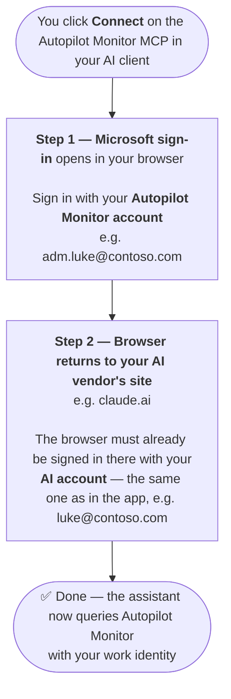

# AI Integration (MCP)

Autopilot Monitor exposes a **Model Context Protocol (MCP)** server that lets AI assistants query enrollment data conversationally: *"show me all failed enrollments from the last 24 hours"*, *"why did session X fail?"*, *"which devices are affected by CVE-2024-30078?"*. Connect Claude Desktop, VS Code with Claude, or any MCP client supporting Streamable HTTP.

## How it works

```
AI client  →  MCP server  →  Backend API  →  Your data
```

Your existing sign-in token is forwarded with every request — the MCP server stores no credentials, and all data access is scoped to your tenant exactly like in the portal.

## Prerequisites

1. **A role in your organization's tenant** — MCP access follows your portal role: an account with a role (Admin, Operator or Viewer) can connect, an account without one cannot, and individual accounts can be blocked. On request, MCP can also be switched off for your whole organization; every connection attempt then shows the recorded reason, while portal and API access stay unchanged. Tenant admins can see usage under **Configuration → Reporting → MCP Usage**.
2. **An MCP-compatible client** — Claude Desktop, VS Code with the Claude extension, or anything speaking Streamable HTTP with OAuth. A client your organization hosts itself, such as LibreChat, is registered by a Tenant Admin first — see [Self-hosted AI clients](#self-hosted-ai-clients). Unattended automation connects with its own application identity instead — see [Service principals and automation](#service-principals-and-automation).

## Client setup

**Server URL:**

```
https://mcp.autopilotmonitor.com/mcp
```

* **Claude Desktop:** Settings → MCP Servers → Add, enter the URL. OAuth authentication runs automatically in the browser.
* **In the portal:** **Settings → Tenant → AI Integration** shows the server URL to copy. Hosted assistants such as Claude, ChatGPT and VS Code need nothing registered there.
* **VS Code (Claude extension):** add to `.vscode/mcp.json` or user settings:

```json
{
  "servers": {
    "autopilot-monitor": {
      "type": "http",
      "url": "https://mcp.autopilotmonitor.com/mcp"
    }
  }
}
```

### Optional: readable (indented) results

Tool results are compact JSON by default because indentation costs your assistant tokens on every call. If you read raw results yourself (for example in an IDE), send the request header `X-MCP-Pretty: 1` and the server returns indented JSON for that client only.

* **VS Code (Claude extension):** add a `headers` object to the server entry:

```json
{
  "servers": {
    "autopilot-monitor": {
      "type": "http",
      "url": "https://mcp.autopilotmonitor.com/mcp",
      "headers": {
        "X-MCP-Pretty": "1"
      }
    }
  }
}
```

* **Claude Code (CLI):** pass the header when adding the server:

```
claude mcp add --transport http autopilot-monitor https://mcp.autopilotmonitor.com/mcp --header "X-MCP-Pretty: 1"
```

Remove the header again when you no longer read raw results — every indented response costs roughly 15–45 % more tokens.

**Verify:** ask your assistant *"List all available tools from Autopilot Monitor"* — you should see 20+ tools. If authentication fails, your MCP access probably isn't enabled yet.

## Protocol support

The server implements the **current MCP specification (revision 2026-07-28)** — the stateless Streamable HTTP transport with `server/discover`, cache hints on tool and resource listings, and header-based request routing — and stays compatible with clients that still use the previous (2025) handshake. You do not have to configure anything: a client picks the newest revision it understands, and the tools, resources and instructions it sees are identical on either path.

Authentication follows the specification's OAuth 2.1 profile: PKCE (S256) is mandatory, the authorization response carries the RFC 9207 issuer so clients can detect mix-up attacks, and clients register either through a **Client ID Metadata Document** (the client identifies itself with an HTTPS URL that serves its metadata — the mechanism the current specification recommends) or, for older clients, through Dynamic Client Registration. Redirect targets are checked against a fixed allowlist of AI-vendor callback URLs plus loopback, whichever registration mechanism a client uses; a self-hosted client may redirect only to the exact callback a Tenant Admin registered for it.

## Signing in — which account goes where

Connecting the MCP server involves **two sign-ins**, and they are often two *different* accounts: the account of your AI subscription (e.g. your personal Claude account) and the work account you use for Autopilot Monitor (often a separate admin account). This is the most common source of confusion during setup.


```mermaid
flowchart TD
    A(["You click <b>Connect</b> on the Autopilot Monitor MCP in your AI client"])
    A --> B["<b>Step 1 — Microsoft sign-in</b> opens in your browser<br/><br/>Sign in with your <b>Autopilot Monitor account</b><br/>e.g. adm.luke@contoso.com"]
    B --> C["<b>Step 2 — Browser returns to your AI vendor's site</b><br/>e.g. claude.ai<br/><br/>The browser must already be signed in there with your<br/><b>AI account</b> — the same one as in the app, e.g. luke@contoso.com"]
    C --> D(["✅ Done — the assistant now queries Autopilot Monitor<br/>with your work identity"])
```


**The one rule to remember:** your **default browser** needs **two sign-ins** — at your AI vendor (e.g. claude.ai) with your **AI account** (the same one used in the app), and at the Microsoft sign-in with your **Autopilot Monitor account**. This only matters when those are two different accounts — if you use one and the same account for both, you won't notice any of this.


If the connect hangs or fails after the Microsoft sign-in succeeded, it is almost always the first half that's missing: the browser is not (or with the wrong account) signed in at your AI vendor's site. Typical causes are multiple browser profiles, or being signed in to the desktop app only but not in the browser. Sign in to the vendor site in your default browser first, then retry the connect.

## Self-hosted AI clients

This part applies only to an AI client your organization runs on its own servers and domain, for example a self-hosted chat front end. Claude, ChatGPT, VS Code and other hosted assistants connect as described in [Client setup](#client-setup) and need no registration.

A self-hosted client connects through the same browser sign-in as Claude. A Tenant Admin registers the client's exact callback URL once; the client then uses the client ID the portal shows.

1. **Find the client's callback URL.** It is the address the client's sign-in returns to; the client's MCP server settings or its documentation show it. LibreChat, for example, uses `https://<your LibreChat host>/api/mcp/<server identifier>/oauth/callback`, with the server identifier shown under the title of its **Edit MCP Server** dialog.
2. **Register it.** Under **Settings → Tenant → AI Integration**, section **Self-hosted AI clients**, enter a name and the callback URL and select **Register**. The URL must use `https` (plain `http` only on `localhost`) and match exactly, without a query or wildcard. A tenant can register one self-hosted client; more are available on request.
3. **Configure the client.** Server URL `https://mcp.autopilotmonitor.com/mcp`, transport Streamable HTTP, authentication **OAuth**. Enter the `amc_…` client ID from the list and leave the client secret empty. Leave the authorization and token URLs empty; the client discovers them.
4. **Connect.** The client opens the Microsoft sign-in. Only accounts in your tenant's Microsoft Entra directory can sign in through the registration, and each user's portal role applies.

Deleting a registration stops new sign-ins and token refreshes of that client within about a minute; an access token already issued stays valid until it expires. Every registration and deletion is written to your audit log.

**"Failed to initialize MCP server" in a self-hosted client** usually has one of three causes:

* The client registers itself dynamically instead of using the registered client ID. Its own domain is on no allowlist, so enter the `amc_…` client ID.
* The callback URL differs from the registered one. Check the server identifier in the path.
* The client is set to a mode that brings its own token, such as on-behalf-of. Choose **OAuth**.

## Available tools

| Category | Tools |
| --- | --- |
| **Search & Discovery** | `search_sessions` (by status, device properties, serial, model, OS, location…) · `search_sessions_by_event` · `search_sessions_by_cve` · `search_events` (hybrid keyword + semantic — finds "machine restarted unexpectedly" without literal word overlap) · `search_knowledge` (semantic search over your rules and IME patterns; an error code in the query also returns its catalog entry) · `lookup_error_code` (explains one Windows, MSI, Windows Update, AppX or Intune error code by hex, decimal, symbol or IME enforcement state) · `search_docs` (semantic search over this documentation) |
| **Session Analysis** | `get_session_summary` (the best starting point: overview, observation coverage with a `gaps` list of what the agent could not see, key events, rule analysis, annotations, stats) · `get_session` · `get_session_events` |
| **Metrics & Observability** | `get_metrics` · `get_app_install_metrics` (incl. Delivery Optimization rollup) · `get_time_attribution` (where enrollment time goes — one session or the fleet) · `get_device_history` (a device's enrollment attempts, or the fleet's first-time-right rate) · `get_geographic_metrics` / `get_geographic_sessions` · `get_vulnerability_summary` · `get_rule_stats` (incl. active rule regressions) · `get_ime_version_history` · `get_usage_metrics` |
| **Inventory & Audit** | `get_software_inventory` · `get_audit_logs` |
| **Raw Data** | `query_raw_events` · `query_raw_sessions` · `get_resource` (discovery catalogs) |

Two **discovery resources** help the assistant use the right vocabulary: `event_types` (every event type string, by category) and `device_properties` (dot-notation property keys like `tpm_status.specVersion` or `hardware_spec.ramTotalGB`).

`search_docs` searches this documentation site, so the assistant can answer product questions — setup, roles, settings, notifications, security and privacy — and cite the page it used. It is a separate corpus from `search_knowledge`: ask *"how does X work?"* and it answers from the docs; ask *"why did this enrollment fail?"* and it reaches for your rules and session data instead.

## Example prompts

* *"Show me all failed enrollments from the last 24 hours"*
* *"Summarize session abc-123 and suggest fixes"*
* *"Which apps cause the most timeouts during enrollment?"*
* *"Compare enrollment performance between Germany and the US"*
* *"Find enrollments with BitLocker issues"*
* *"Which devices are affected by CVE-2024-30078?"*
* *"How has the failure rate changed this week?"*
* *"Where does enrollment time go in our user-driven enrollments, and which blocking app costs the most?"*
* *"Which devices needed more than one attempt this month, and what failed the first time?"*
* *"How do I roll the agent out with Intune?"* (answered from this documentation)

The assistant picks the right tools and chains them — e.g. finding a session by device name first, then pulling its event timeline.

## Service principals and automation

A scheduled report, a pipeline or an agent that runs without a person signed in connects with its **own application identity** rather than a user's. It is granted like a team member and is always read-only.

1. **Register the application in your Entra tenant** (or use one you already have — a federated credential, a certificate or a client secret all work; the platform only sees the resulting token).
2. **Grant it the Autopilot Monitor application permission.** On the application's **API permissions** page choose *APIs my organization uses* → **Autopilot Monitor** → *Application permissions* → `access_as_application`, then **Grant admin consent** for your tenant. Without this consent the token is refused before any role check.
3. **Add it as a member.** Under **Settings → Access Management** switch the add form to **Service principal**, enter the application (client) ID and add it. Service principals always hold the **Viewer** role; the role selector is fixed. To let it read tenants you manage as an MSP, assign it under **Settings → Tenant → Delegated Access** like any other member.
4. **Obtain a token and call the server.** Request a client-credentials token for `api://886ab5e2-6144-442c-80cc-9b28e0667731/.default` from your tenant's Entra endpoint and send it as `Authorization: Bearer …` to `https://mcp.autopilotmonitor.com/mcp` (Streamable HTTP). There is no OAuth sign-in and no browser step; the token typically lasts about an hour, after which the application requests a new one.

Its calls count against your organization's MCP budget like a person's and appear on the **MCP Usage** page marked **App**; disabling or removing the member blocks it. A service principal can never change configuration, annotate sessions or trigger device actions, whatever its Entra permissions say.

## Rate limits and usage plans

Requests are rate-limited to **60 per minute per user** (sliding window). Exceeding it returns HTTP 429 with `retryAfterSeconds`; clients typically retry automatically. Overall MCP usage is additionally **tied to your tenant's usage plan**, with two budgets: a daily and monthly quota **per account**, and a daily and monthly quota **for your whole organization** that every member's requests count against — adding accounts does not add budget. When either is exhausted, the assistant receives a message naming which budget it was and when it resets. Tenant admins can track consumption against both budgets under **Configuration → Reporting → MCP Usage**, including a breakdown of the organization budget by account.

**Delegated (MSP) administrators:** every request you make — into your own tenant or into a tenant you manage — counts against **your** organization's budget and your own per-account budget, both from your home tenant's plan. A managed tenant's budget is never touched and never blocks you. Each managed-tenant slot you buy beyond the two included in Pro extends both of your budgets; the MCP Usage page shows the breakdown.
