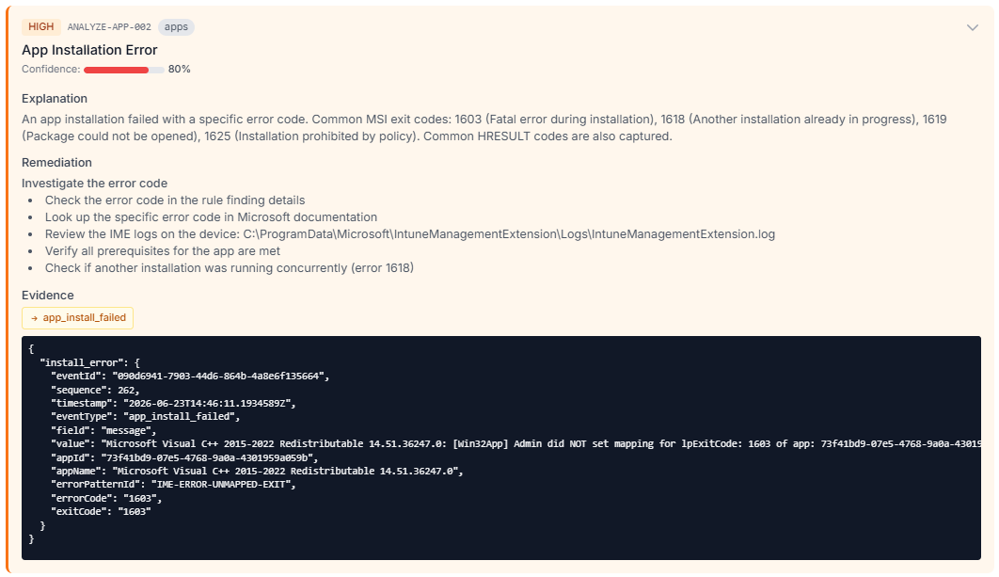

# Session Details & Diagnosis

## Session detail

Opening a session from the dashboard shows everything Autopilot Monitor knows about that enrollment, updating live over SignalR while the enrollment runs. The page is a stack of collapsible sections with a scroll-spy sidebar:

* **Session Info** — status, enrollment duration, enrollment type, ConfigMgr detection, NTP offset.
* **Device Details** — a deep telemetry card: OS build/edition, per-adapter network configuration (Wi-Fi SSID and signal, proxy config, active interface), security posture (Secure Boot, TPM, BitLocker with encryption method), agent and IME versions (with an *outdated* badge when applicable), the full **Autopilot profile** including a clickable OOBE-configuration bitmask decoder, and hardware specs down to DIMMs, disks, battery health, and GPUs.
* **Enrollment Progress** — the phase timeline; click a phase to jump to its events. Pre-provisioning (White Glove) sessions show the technician phase and the user phase separately.
* **Analysis** — the [analyze rule](../rules/analyze-rules/README.md) findings as severity-colored cards with a confidence bar and a *"fires on X % of enrollments in your tenant"* context note from 30-day rule telemetry. Expanding a card reveals the explanation, remediation steps, related docs, and an **Evidence** block whose links jump to the exact triggering event in the timeline. **Analyze Now** re-runs all rules on demand (analysis also runs automatically at completion/failure).

<figure><figcaption>
An expanded finding: severity and confidence at the top, the explanation and remediation steps in the middle, and the raw evidence — with a link to the exact triggering event — at the bottom.
</figcaption></figure>

* **Performance** — charts from the periodic performance snapshots.
* **Script Executions** — platform and remediation scripts with their output (stdout visibility is a [tenant setting](../reference/settings.md#agent-parameters); stderr is always shown).
* **Downloads / Install Progress** — per-app download progress and the full install lifecycle, including Office Click-to-Run with a live timer.
* **Event Timeline** — the raw, phase-grouped event stream with severity filters (Info/Warning/Error/Critical), expand/collapse controls, and auto-scroll for live sessions.

**Header actions:** **Collect Logs** (see below), **Download Diagnostics** (when a diagnostics package was uploaded), **Diagnosis** (failed sessions), **Report Session** (send a report with comment and optional attachments), and — with [Admin Mode](../concepts/roles-and-permissions.md#admin-mode) on an *In Progress*/*Pending* session — **Succeed** / **Fail** overrides.

## On-demand log collection

While an enrollment is running (*In Progress*, *Pending*, or *Stalled*), **Collect Logs** asks the agent to build and upload a diagnostics package right away — without waiting for the enrollment to finish. The request rides along with the agent's next telemetry check-in, so a package typically arrives within a minute; the button tracks the round trip live (*Waiting for agent… → Collecting…*) and **Download Diagnostics** lights up as soon as the upload lands. On-demand packages carry a `-server-requested` suffix in the file name, distinguishing them from the regular end-of-enrollment package (which later replaces them as the downloadable package).

Admins and Operators can trigger a collection once [diagnostics upload](../reference/settings.md#diagnostics-package) is configured. When it is not configured, the button stays visible but disabled — a Tenant Admin clicking it gets a one-step dialog that enables hosted storage with mode *On Failure Only* and collects immediately; the destination and mode can be changed in Settings at any time afterwards.

## Guided diagnosis

For a failed session, the **Diagnosis** button opens a focused, remediation-first view that answers one question: *why did this fail, and how do I fix it?*

* The **Primary Suspect** card presents the highest-confidence finding in plain language, with an *Evidence Found* list and a **Quick Fix** box whose remediation steps can be copied with one click.
* **Other Possibilities** lists lower-ranked findings; **Error Events** and **Warnings** summarize the raw error messages with timestamps.
* **View Evidence** links back into the full session's timeline, and **Full Details** returns to the complete session page.

The diagnosis view is deliberately minimal — no device details, no admin controls — making it the right link to share with a colleague who just needs to fix the device.
