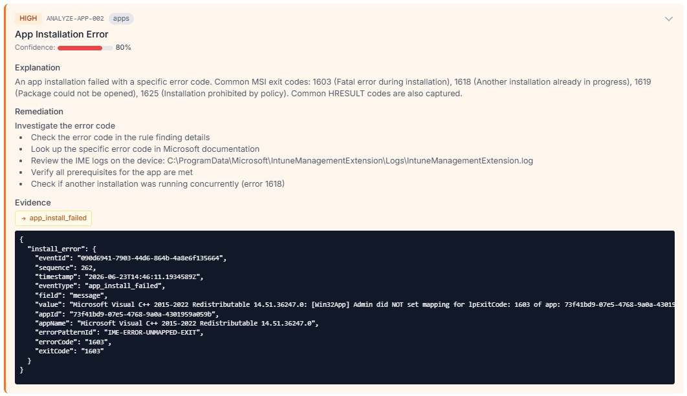

# Session Details & Diagnosis

## Session detail

Opening a session from the dashboard shows everything Autopilot Monitor knows about that enrollment, updating live over SignalR while the enrollment runs. The page is a stack of collapsible sections with a scroll-spy sidebar:

* **Session Info** — status, enrollment duration, enrollment type, ConfigMgr detection, NTP offset.
* **Device Details** — a deep telemetry card: OS build/edition, per-adapter network configuration (Wi-Fi SSID and signal, proxy config, active interface), security posture (Secure Boot, TPM, BitLocker with encryption method), agent and IME versions (with an *outdated* badge when applicable), the full **Autopilot profile** including a clickable OOBE-configuration bitmask decoder, and hardware specs down to DIMMs, disks, battery health, and GPUs.
* **Enrollment Progress** — the phase timeline; click a phase to jump to its events. Pre-provisioning (White Glove) sessions show the technician phase and the user phase separately. Below the timeline, finished enrollments carry the [Time attribution](#time-attribution) breakdown.
* **Analysis** — the [analyze rule](../rules/analyze-rules/README.md) findings as severity-colored cards with a confidence bar and a *"fires on X % of enrollments in your tenant"* context note from 30-day rule telemetry. Expanding a card reveals the explanation, remediation steps, related docs, and an **Evidence** block whose links jump to the exact triggering event in the timeline. **Analyze Now** re-runs all rules on demand (analysis also runs automatically at completion/failure).

<figure><figcaption>
An expanded finding: severity and confidence at the top, the explanation and remediation steps in the middle, and the raw evidence — with a link to the exact triggering event — at the bottom.
</figcaption></figure>

* **Annotations** — your team's own verdict on the session, next to the automated analysis. See [Annotations](#annotations).
* **Performance** — charts from the periodic performance snapshots.
* **Script Executions** — platform and remediation scripts with their output (stdout visibility is a [tenant setting](../reference/settings.md#agent-parameters); stderr is always shown).
* **Downloads / Install Progress** — per-app download progress and the full install lifecycle. Rows that do not come from the Intune Management Extension carry a small source pill — **Click-to-Run** for the Microsoft 365 Apps installation (with a live timer) and **RealmJoin** for RealmJoin packages — so a Win32 app and the underlying installer it triggers are visibly two different rows instead of looking like a duplicate.
* **Event Timeline** — the raw, phase-grouped event stream with severity filters (Info/Warning/Error/Critical), expand/collapse controls, and auto-scroll for live sessions.

**Header actions:** **Collect Logs** (see below), **Download Diagnostics** (when a diagnostics package was uploaded), **Diagnosis** (failed sessions), **Report Session** (send a report with comment and optional attachments), and — with [Admin Mode](../concepts/roles-and-permissions.md#admin-mode) on an *In Progress*/*Pending* session — **Succeed** / **Fail** overrides.

## Device history

If the device behind the session has enrolled before, a banner at the top of the page says so: **"Attempt 3 for this device · 2 previous enrollments recorded"**. It is the answer to *"is this a new problem, or has this machine been fighting us all week?"* — a question the session page alone could never answer.

**View history** expands the device's last 20 finished enrollments, newest first, each with its final status, start time, recorded duration, and a link to open it. Badges mark **Pre-provisioning** and **Device Preparation** enrollments, and **admin-marked** flags a session whose final status an administrator set by hand. The attempt number follows the [device journey](../concepts/sessions-and-statuses.md#device-journeys--attempts) rules — a pre-provisioned device that is later handed to a user is *one* attempt, not two, and a re-deployment months later starts counting at 1 again.

Devices are matched by serial number. Devices without a usable serial number get no banner rather than a wrong one.

## Time attribution

Once an enrollment has finished with a real verdict — *Succeeded* or *Failed* — the phase timeline is followed by a **Time attribution** bar: where the enrollment's minutes actually went, split into **Device preparation**, **Apps (ESP)**, **Identity & Hello**, **User ESP**, **Desktop handoff**, and an explicit **Unattributed** remainder. The bar always adds up to the session's recorded enrollment duration — time that could not be assigned to a segment is shown as unattributed instead of being distributed or hidden. For pre-provisioning enrollments, the pause between the technician phase and the user phase is excluded, exactly as it is from the enrollment duration itself.

* A **reboot badge** (e.g. *⟳ 2 reboots · 4m 10s*) reports how much of the enrollment was spent restarting. Reboots are shown next to the bar, not as a slice of it — a reboot happens *inside* whichever segment it started in.
* **ESP-blocking apps** lists the apps that held up the Enrollment Status Page with their observed install time, plus the **critical path** total (overlapping installs counted once). Blocking membership comes from the device's own ESP tracking data. Where that data was never observed, the section says so — *unknown*, not zero — and an app that was still installing when the enrollment ended is counted but has no bar.
* **Data-quality chips** disclose anything that limits the split for this session, e.g. *"Agent started late — early phases underobserved"* or *"ESP blocking list truncated"*.

The breakdown is written when the enrollment finishes. Sessions from the **last 30 days** that finished before this feature shipped are filled in by the regular maintenance pass; older sessions stay without one.

The fleet-wide view of the same data — medians per enrollment class and the apps that cost the most across all enrollments — is on [Fleet Health](fleet-health.md#time-attribution).

## Annotations

The automated analysis says what the rules *think* happened; the **Annotations** section, directly below it, records what your team *knows* happened. Once a session has been investigated, whoever worked it leaves a structured verdict plus an optional note — so the conclusion travels with the session instead of living in a ticket, a chat thread, or someone's memory.

An annotation has two parts:

* A **verdict** about the automated analysis: **Root cause confirmed** (the analysis was right), **Analysis wrong** (it pointed at the wrong cause), **Different problem** (the real issue was something the rules did not cover), or **Inconclusive**.
* A free-text **note** — what actually happened, what the analysis missed, what fixed it.

Either part can stand alone: a quick verdict without a note is fine, and so is a note without a verdict.

Annotations are recorded **per role**, so an Operator's field observation and a Tenant Admin's conclusion coexist without overwriting each other:

* The **Operator** annotation can be written by Operators and Tenant Admins.
* The **Tenant Admin** annotation can be written by Tenant Admins only.
* **Viewers** see all annotations read-only.

Each annotation shows its author and last-edited time. Saving again overwrites that role's previous verdict and note; clearing both fields removes it. The section starts collapsed — the header shows at a glance whether a verdict has been recorded, without taking space from the diagnosis work above it.

Two things make annotations worth the ten seconds they take:

* **They close the loop on rule quality.** Every annotation records which analysis rules had fired at the time, so confirmations and corrections show — per rule — where the analysis is right and where it misleads. That is what drives rule improvements over time.
* **They travel with a report.** When someone [reports a session](#session-detail), the annotations are included in the report package — the investigating team starts from your team's own conclusion instead of from zero.

## On-demand log collection

While an enrollment is running (*In Progress*, *Pending*, or *Stalled*), **Collect Logs** asks the agent to build and upload a diagnostics package right away — without waiting for the enrollment to finish. The request rides along with the agent's next telemetry check-in, so a package typically arrives within a minute; the button tracks the round trip live (*Waiting for agent… → Collecting…*) and **Download Diagnostics** lights up as soon as the upload lands. On-demand packages carry a `-server-requested` suffix in the file name, distinguishing them from the regular end-of-enrollment package (which later replaces them as the downloadable package).

Admins and Operators can trigger a collection once [diagnostics upload](../reference/settings.md#diagnostics-package) is configured. When it is not configured, the button stays visible but disabled — a Tenant Admin clicking it gets a one-step dialog that enables hosted storage with mode *On Failure Only* and collects immediately; the destination and mode can be changed in Settings at any time afterwards.

## Guided diagnosis

For a failed session, the **Diagnosis** button opens a focused, remediation-first view that answers one question: *why did this fail, and how do I fix it?*

* The **Primary Suspect** card presents the highest-confidence finding in plain language, with an *Evidence Found* list and a **Quick Fix** box whose remediation steps can be copied with one click.
* **Other Possibilities** lists lower-ranked findings; **Error Events** and **Warnings** summarize the raw error messages with timestamps.
* **View Evidence** links back into the full session's timeline, and **Full Details** returns to the complete session page.

The diagnosis view is deliberately minimal — no device details, no admin controls — making it the right link to share with a colleague who just needs to fix the device.
