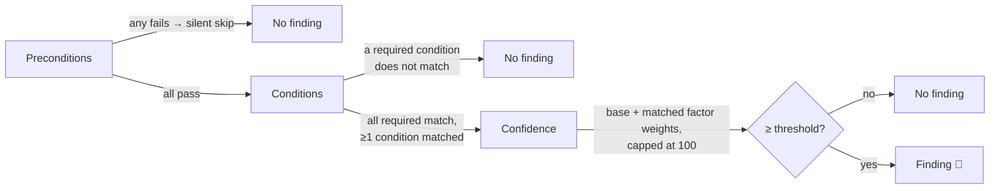

# Concepts

An analyze rule is a JSON document evaluated against a session's **entire event stream**. This page explains every building block; the [Cookbook](cookbook.md) shows them in action.

## Anatomy of a rule

```json
{
  "ruleId": "ANALYZE-APP-004",
  "title": "Insufficient Disk Space",
  "description": "Detects when disk space is critically low during enrollment...",
  "severity": "critical",
  "category": "apps",
  "version": "1.1.0",
  "enabled": true,
  "preconditions": [],
  "conditions": [
    {
      "signal": "low_disk",
      "source": "event_type",
      "eventType": "performance_snapshot",
      "dataField": "disk_free_gb",
      "operator": "lt",
      "value": "5",
      "required": true
    }
  ],
  "baseConfidence": 75,
  "confidenceFactors": [
    { "signal": "app_failed", "condition": "exists", "weight": 15 }
  ],
  "confidenceThreshold": 40,
  "explanation": "Disk free space dropped below 5 GB...",
  "remediation": [ { "title": "Free disk space", "steps": ["..."] } ],
  "tags": ["apps", "disk-space"]
}
```

| Field | Purpose |
| --- | --- |
| `ruleId` | Unique ID matching `ANALYZE-<AREA>-<NNN>`. Custom rules created from templates get a `-CUSTOM` suffix. |
| `severity` | `info` · `warning` · `high` · `critical` — drives the finding's color and the session's severity statistics. |
| `category` | `network` · `identity` · `apps` · `device` · `esp` · `enrollment` · `security` — used for filtering. |
| `preconditions` | Device-fact gates checked **before** anything else (see below). |
| `conditions` | The matching logic — the heart of the rule. |
| `baseConfidence` / `confidenceFactors` / `confidenceThreshold` | The confidence model (see below). |
| `explanation` | Markdown shown on the finding. Supports `{{field}}` interpolation with evidence from the matched events. |
| `remediation` | One or more titled step lists telling the reader what to do. |
| `markSessionAsFailedDefault` | If `true`, a firing rule marks the entire session as **Failed** — a knock-out criterion. Tenant admins can override this per rule. |

## How a rule is evaluated



1. **Preconditions** — every precondition must pass, otherwise the rule is skipped **silently** (no finding, no card). Use them to scope a rule to devices where it makes sense at all — e.g. *skip virtual machines* for a firmware check. Preconditions are pure gates; they never contribute evidence or confidence.
2. **Conditions** — all conditions marked `"required": true` must match. Optional conditions (`"required": false`) don't block the rule; they collect additional evidence and can feed confidence factors. At least one condition must match overall — a rule with only optional conditions never fires vacuously.
3. **Confidence** — the score starts at `baseConfidence`, each matched confidence factor adds its `weight`, the total is capped at 100. The finding is only shown if the score reaches `confidenceThreshold`.

## Condition sources

The `source` field selects *how* a condition looks at the event stream:

| Source | What it does | Typical use |
| --- | --- | --- |
| `event_type` | Matches events of a type; with `dataField`, additionally tests one field on those events | "an `enrollment_failed` event exists", "`disk_free_gb < 5` on any snapshot" |
| `event_data` | Tests a field in an event's data payload; supports dot notation for nested fields (`scan_summary.critical_cves`) | Inspecting structured payloads, gather-rule outputs |
| `event_data_array` | Iterates an **array** field (`dataField`) and tests a sub-field (`itemField`) on each element — matches if **any** element satisfies the operator | Allow-lists: "any provisioning package whose `identity` does *not* match my regex" |
| `event_count` | Counts events: `count_gte` (total) or `count_per_group_gte` (per group key in `dataField`, e.g. per `appId`). An optional **value filter** (`filterField` / `filterOperator` / `filterValue`) restricts which events are counted | "3+ install starts of the same app", "≥3 snapshots with `memory_used_percent > 90`" |
| `phase_duration` | The duration of an ESP phase in seconds (phase selected via `dataField`/`value` on `esp_phase_changed`) | "DeviceSetup took too long" |
| `app_install_duration` | Seconds between `app_install_started` and its completion for the same app | "an app took more than 10 minutes to install" |
| `event_correlation` | Joins two event types (A then B) on a shared field, optionally within a time window | "install completed, then later reported failed — for the *same* app" |

## Operators

All comparisons are case-insensitive.

| Operator | Meaning |
| --- | --- |
| `equals` / `not_equals` | Exact match |
| `contains` / `not_contains` | Substring |
| `regex` / `not_regex` | Regular expression (.NET syntax, 1-second evaluation timeout; an invalid regex simply never matches) |
| `gt` / `lt` / `gte` / `lte` | Numeric comparison |
| `exists` / `not_exists` | Field present and non-empty / absent or empty |
| `in` / `not_in` | Membership in a comma-separated list |
| `count_gte` / `count_per_group_gte` | Count thresholds — only with `source: event_count` |

## Correlation conditions

With `source: event_correlation` a single condition spans **two** events:

```json
{
  "signal": "reverted_after_success",
  "source": "event_correlation",
  "eventType": "app_install_completed",
  "correlateEventType": "app_install_failed",
  "joinField": "appId",
  "timeWindowSeconds": 3600,
  "required": true
}
```

* `eventType` is event **A**, `correlateEventType` is event **B**; the rule matches when B follows A and both share the same `joinField` value.
* `timeWindowSeconds` (optional) caps how far apart A and B may be.
* `eventAFilterField` / `eventAFilterOperator` / `eventAFilterValue` (optional) pre-filter which A events qualify.

## Suppression — don't alert on solved problems

Any condition can carry a `suppressByEvent` block:

```json
"suppressByEvent": { "eventType": "app_install_completed", "joinField": "appId" }
```

If a *resolving* event of that type exists with the same `joinField` value as the matched event, the match is discarded. This is how built-in rules avoid alerting on an app failure that a later retry fixed.

## The confidence model

Confidence expresses *how sure* the rule is, and gates whether the finding is shown at all:

> **score = min(baseConfidence + Σ weights of matched factors, 100)** — shown only if **score ≥ confidenceThreshold**

Each confidence factor has a `signal`, a `condition` expression, and a `weight`. Three expressions are supported:

| Factor `condition` | Matches when… | `signal` must be… |
| --- | --- | --- |
| `"exists"` | a **condition with the same signal name** matched | the `signal` of one of the rule's (usually optional) conditions |
| `"count >= N"` | the session contains at least N events **of the event type named by the signal** | an event type, e.g. `app_install_failed` |
| `"phase_duration > N"` | the matched phase lasted longer than N seconds | the signal of a `phase_duration` condition |


The `signal` linkage is exact: an `"exists"` factor whose signal doesn't match any condition's signal never fires. The typical pattern is: add an **optional** condition (e.g. `app_failed` testing for `app_install_failed` events), then a factor with the **same signal** to reward its presence with extra confidence.


**Tuning guide:** `baseConfidence` is what a bare match is worth (50 = plausible, 75+ = strong signal). Use a threshold **above** the base when the rule should only fire with corroborating factors — e.g. base 50, factor +40, threshold 70 means "phase exists" alone never fires, "phase exists *and* is long" does.

## Evidence and `{{interpolation}}`

Every matched condition records evidence: the matched event, the field, and its value. In the `explanation`, `{{fieldName}}` placeholders resolve against the matched evidence by **data field name** — `{{appName}}`, `{{errorCode}}`, `{{reason}}`. A common pattern is adding optional `exists` conditions purely to *harvest* fields for the explanation. A placeholder whose field wasn't recorded stays visible as literal `{{…}}` — built-in rules mention this in their text so readers aren't confused.

## Custom rules, versions, and IDs

* Custom rules are created on the Analyze Rules page (**Create Custom Rule**), in form mode or raw JSON — advanced constructs like `event_correlation` require JSON mode.
* The `version` is bumped automatically when you edit a rule in the portal, and `author` is set to the editing user.
* Built-in and community rules are read-only; **Export** any of them as JSON to use as a starting point for your own rule.
