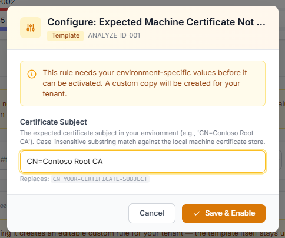

# Template Rules

Some detections only make sense with knowledge of *your* environment: which certificate subject to expect, which kiosk accounts may use AutoLogon, which provisioning packages are yours. **Template rules** package that logic as blueprints with clearly marked blanks.

## How templates work

1. Template rules live on the **Templates** tab of the Analyze Rules page and are **off by default** — they can't do anything useful until configured.
2. When you enable one, a dialog asks for the template values (each with a description and an example).

<figure><figcaption>
Configuring a template is one small form — fill in your value, <em>Save &amp; Enable</em>, and a tailored custom copy of the rule goes live for your tenant.
</figcaption></figure>

3. Submitting creates **your own editable copy** with a `-CUSTOM` suffix (e.g. `ANALYZE-ID-001-CUSTOM`), which appears on the Rules tab like any custom rule — you can refine it further, in form or JSON mode.
4. The original template stays on the Templates tab, disabled. Deleting your copy frees the template to be configured again.

## Available templates

### ANALYZE-ID-001: Expected Machine Certificate Not Found

**You provide:** the certificate subject you expect on every device (e.g. `CN=Contoso Root CA` — case-insensitive substring match).

The rule checks the machine certificate store inventory (collected by the community gather rule **GATHER-ID-002** at the *FinalizingSetup* phase) and warns when no certificate with your subject is present — catching failed SCEP/PKCS profile deployments before the user notices Wi-Fi or VPN doesn't work.


This template depends on the **GATHER-ID-002** gather rule being enabled — that's what produces the `gather_machine_cert_store` event the analyze rule inspects. It's a working example of the [gather + analyze pattern](cookbook.md#recipe-7-collect-your-own-data-and-grade-it-end-to-end).


### ANALYZE-SEC-004: AutoLogon enabled for an unexpected user

**You provide:** a comma-separated list of approved kiosk / shared-device account names (case-insensitive exact match against the Winlogon `DefaultUserName`).

AutoLogon is legitimate for kiosks — and a normal Autopilot enrollment even uses Windows' own temporary ESP auto-logon, which is registry-indistinguishable from a kiosk setup. That's why "AutoLogon enabled" alone is deliberately not graded by default (only a plaintext password is, via ANALYZE-SEC-003). This template lets you go further: once you declare which accounts *may* use AutoLogon, any other account raises a warning.

### ANALYZE-SEC-006: Unexpected Provisioning Package (Custom Allow-List)

**You provide:** the allow-list regex, pre-filled with the same OS-inbox and OEM factory-preload defaults as the built-in ANALYZE-SEC-005.

Extend it with your own known-good packages (bulk-enrollment PPKGs, OEM recovery packages, deployment tooling), then **disable ANALYZE-SEC-005** — from then on only packages outside *your* list alert.


The allow-list regex is **anchored** (`^(?:…)`), so insert new alternatives *inside* the group, before the closing `)` — for example `…|SecureStart\.Settings\b|Contoso\.Recovery)`. Appending after the group will silently never match; the rule's remediation text explains this too.


## Templates vs. exporting a built-in

Templates are for rules that are *designed* around a configurable value. If you want to customize any other built-in rule (different threshold, extra condition), use **Export** on the rule to get its JSON and create a custom rule from it — see the [Cookbook](cookbook.md).
