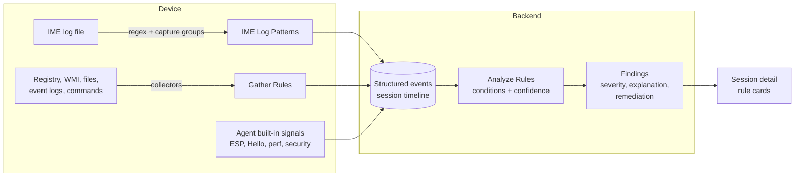

# How Rules Work Together

Rules are what turn Autopilot Monitor from a log viewer into an analysis engine. There are three rule families, each answering a different question:

| Family | Question it answers | Runs | Managed on |
| --- | --- | --- | --- |
| [**IME Log Patterns**](ime-log-patterns.md) | *How do we turn raw IME log lines into structured events?* | On the device (agent) | IME Log Patterns page |
| [**Gather Rules**](gather-rules.md) | *What extra evidence should the agent collect?* | On the device (agent) | Gather Rules page |
| [**Analyze Rules**](analyze-rules/README.md) | *What do all these events mean — is something wrong?* | In the backend | Analyze Rules page |

## The pipeline

1. **Events come first.** Most timeline events come from the agent's built-in signals and from **IME Log Patterns**, which parse the Intune Management Extension log in real time — app downloads, installs, ESP phases, errors. If the built-in events don't cover something specific to your environment, **Gather Rules** collect it: a registry value your imaging process writes, a vendor log file, a WMI query, an allow-listed command.
2. **Analyze Rules read the events.** After events arrive, the backend evaluates every enabled analyze rule against the session's full event stream. A rule that matches produces a **finding**: a card on the session with severity, a confidence score, an explanation of what was detected, and concrete remediation steps.
3. **Findings drive everything downstream** — the session's analysis summary, severity statistics, fleet-level rule telemetry, and (if configured on the rule) even marking the whole session as failed.

## Which rule type do I need?

* *"The timeline is missing information that exists somewhere on the device"* → a **Gather Rule** to collect it.
* *"I want to be alerted automatically when condition X is true in a session"* → an **Analyze Rule**.
* *"Both — I need custom data **and** an automatic verdict on it"* → a Gather Rule feeding an Analyze Rule. This combination is the most powerful pattern in the product; see [Cookbook recipe 7](analyze-rules/cookbook.md#recipe-7-collect-your-own-data-and-grade-it-end-to-end).
* *"A known IME log line isn't being recognized anymore"* → an **IME Log Pattern** fix (these are community-maintained; see [contributing](ime-log-patterns.md#contributing-patterns)).

## Built-in, community, template, custom

All three families ship with maintained built-in rules, so you get full value with zero configuration. On top of that:

* **Community** rules are contributed via GitHub and shown with a *Community* badge — same review and quality bar as built-ins.
* **Template** rules ship as configurable blueprints (e.g. an allow-list you fill in). Enabling one creates your own editable copy. See [Template Rules](analyze-rules/template-rules.md).
* **Custom** rules are yours alone — created in the portal, scoped to your tenant. The [Cookbook](analyze-rules/cookbook.md) walks you through building them.
